# WOD 冒险小队 MVP — 架构与流程 Mermaid 文档

> 本文档配合 [mvp文档.md](mvp文档.md) 使用，用 Mermaid 图把 MVP 的**玩法循环、战斗与副本、数据模型、系统架构、数据流、工程规划**可视化。
> 所有图均直接可渲染（Markdown 预览 / VSCode Mermaid 插件 / mermaid.live）。

## 目录

- [第一部分 · 核心玩法与节奏](#第一部分--核心玩法与节奏)
  - [1.1 核心体验循环](#11-核心体验循环) · [1.2 每日回合流程](#12-每日回合流程) · [1.3 远征决策](#13-远征决策)
  - [1.4 30 天内容节奏](#14-30-天内容节奏) · [1.5 游戏阶段状态机](#15-游戏阶段状态机)
- [第二部分 · 战斗与副本](#第二部分--战斗与副本)
  - [2.1 自动战斗回合流程](#21-自动战斗回合流程) · [2.2 副本生命周期](#22-副本生命周期) · [2.3 副本多层推进与状态传递](#23-副本多层推进与状态传递)
  - [2.4 情报分层解锁](#24-情报分层解锁) · [2.5 职业定位象限](#25-职业定位象限) · [2.6 副本系统结构](#26-副本系统结构)
- [第三部分 · 数据模型](#第三部分--数据模型)
  - [3.1 核心数据模型 ER 图](#31-核心数据模型-er-图) · [3.2 战术配置模型](#32-战术配置模型)
- [第四部分 · 系统架构与数据流](#第四部分--系统架构与数据流)
  - [4.1 系统整体架构](#41-系统整体架构) · [4.2 后端四层架构](#42-后端四层架构) · [4.3 结束当天完整时序](#43-结束当天完整时序)
  - [4.4 队伍配置数据流](#44-队伍配置数据流) · [4.5 前后端职责划分](#45-前后端职责划分)
- [第五部分 · 工程规划](#第五部分--工程规划)
  - [5.1 项目结构](#51-项目结构) · [5.2 MVP 开发路线图](#52-mvp-开发路线图) · [5.3 API 设计](#53-api-设计) · [5.4 副本词缀系统](#54-副本词缀系统)

---

## 第一部分 · 核心玩法与节奏

### 1.1 核心体验循环

对应 §2.2。玩家在「发现机会 → 判断风险 → 获取情报 → 调整构筑 → 自动战斗 → 阅读战报 → 调整策略」中循环，并获得明确策略成就感。

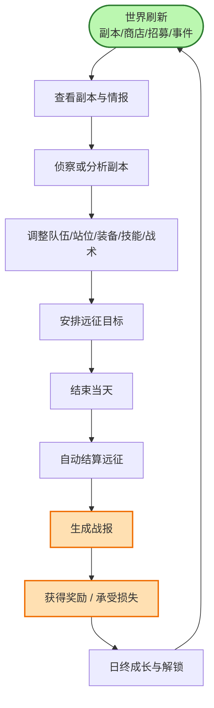
```mermaid
flowchart TD
    A([世界刷新<br/>副本/商店/招募/事件]) --> B[查看副本与情报]
    B --> C[侦察或分析副本]
    C --> D[调整队伍/站位/装备/技能/战术]
    D --> E[安排远征目标]
    E --> F[结束当天]
    F --> G[自动结算远征]
    G --> H[生成战报]
    H --> I[获得奖励 / 承受损失]
    I --> J[日终成长与解锁]
    J --> A

    classDef start fill:#bbf7b0,stroke:#2e7d32,stroke-width:2px;
    classDef report fill:#ffe0b2,stroke:#ef6c00,stroke-width:2px;
    class A start;
    class H,I report;
```

### 1.2 每日回合流程

对应 §5。一个回合 = 游戏内一天，分为「开始 → 规划 → 确认 → 结算」四个阶段。

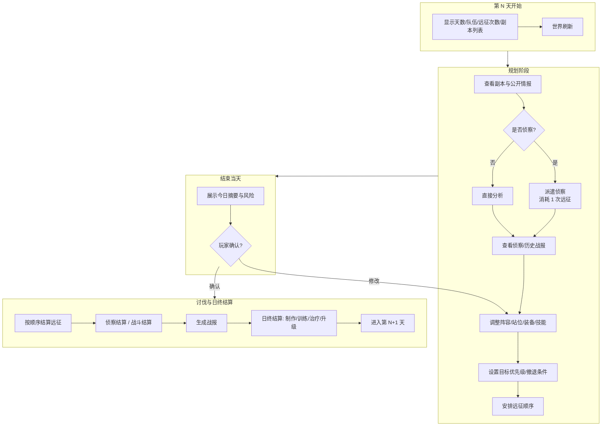
```mermaid
flowchart TD
    subgraph DayStart["第 N 天开始"]
        A1[显示天数/队伍/远征次数/副本列表] --> A2[世界刷新]
    end
    subgraph Planning["规划阶段"]
        B1[查看副本与公开情报] --> B2{是否侦察?}
        B2 -->|是| B3[派遣侦察<br/>消耗 1 次远征]
        B2 -->|否| B4[直接分析]
        B3 --> B5[查看侦察/历史战报]
        B4 --> B5
        B5 --> B6[调整阵容/站位/装备/技能]
        B6 --> B7[设置目标优先级/撤退条件]
        B7 --> B8[安排远征顺序]
    end
    subgraph Confirm["结束当天"]
        C1[展示今日摘要与风险] --> C2{玩家确认?}
    end
    subgraph Resolve["讨伐与日终结算"]
        D1[按顺序结算远征] --> D2[侦察结算 / 战斗结算]
        D2 --> D3[生成战报]
        D3 --> D4[日终结算: 制作/训练/治疗/升级]
        D4 --> D5[进入第 N+1 天]
    end

    DayStart --> Planning --> Confirm
    C2 -->|修改| B6
    C2 -->|确认| Resolve
```

### 1.3 远征决策

对应 §2.1 / §5.3 / §14.2。远征次数是最重要的战略资源，玩家在「硬打 / 侦察 / 准备 / 放弃」之间产生真实取舍。

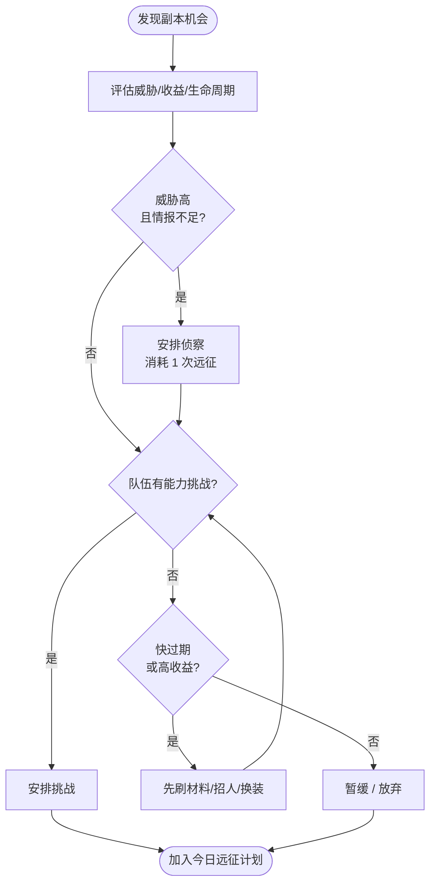
```mermaid
flowchart TD
    Start([发现副本机会]) --> Eval[评估威胁/收益/生命周期]
    Eval --> Q1{威胁高<br/>且情报不足?}
    Q1 -->|是| Scout[安排侦察<br/>消耗 1 次远征]
    Q1 -->|否| Q2{队伍有能力挑战?}
    Scout --> Q2
    Q2 -->|是| Challenge[安排挑战]
    Q2 -->|否| Q3{快过期<br/>或高收益?}
    Q3 -->|是| Prepare[先刷材料/招人/换装]
    Q3 -->|否| Postpone[暂缓 / 放弃]
    Prepare --> Q2
    Challenge --> End([加入今日远征计划])
    Postpone --> End
```

### 1.4 30 天内容节奏

对应 §4.1。MVP 用 30 天作为一局基础长度，内容随天数逐步解锁。

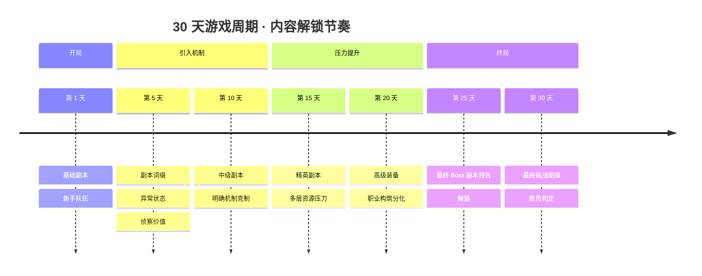
```mermaid
timeline
    title 30 天游戏周期 · 内容解锁节奏
    section 开局
        第 1 天 : 基础副本 : 新手队伍
    section 引入机制
        第 5 天 : 副本词缀 : 异常状态 : 侦察价值
        第 10 天 : 中级副本 : 明确机制克制
    section 压力提升
        第 15 天 : 精英副本 : 多层资源压力
        第 20 天 : 高级装备 : 职业构筑分化
    section 终局
        第 25 天 : 最终 Boss 副本预告 : 解锁
        第 30 天 : 最终挑战期限 : 胜负判定
```

### 1.5 游戏阶段状态机

对应 §4 / §28。一局游戏的状态流转，包含软失败（时间期限）。

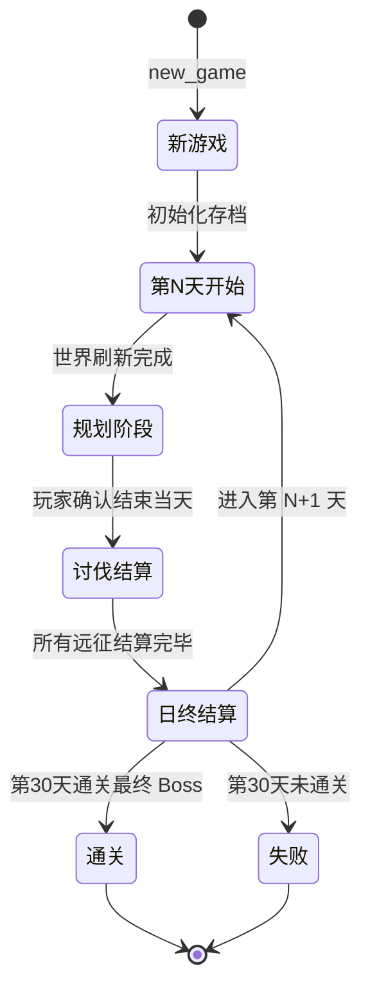
```mermaid
stateDiagram-v2
    [*] --> 新游戏 : new_game
    新游戏 --> 第N天开始 : 初始化存档
    第N天开始 --> 规划阶段 : 世界刷新完成
    规划阶段 --> 讨伐结算 : 玩家确认结束当天
    讨伐结算 --> 日终结算 : 所有远征结算完毕
    日终结算 --> 第N天开始 : 进入第 N+1 天
    日终结算 --> 通关 : 第30天通关最终 Boss
    日终结算 --> 失败 : 第30天未通关
    通关 --> [*]
    失败 --> [*]
```

---

## 第二部分 · 战斗与副本

### 2.1 自动战斗回合流程

对应 §9。玩家不手操，战前配置战术，战斗自动按速度行动。

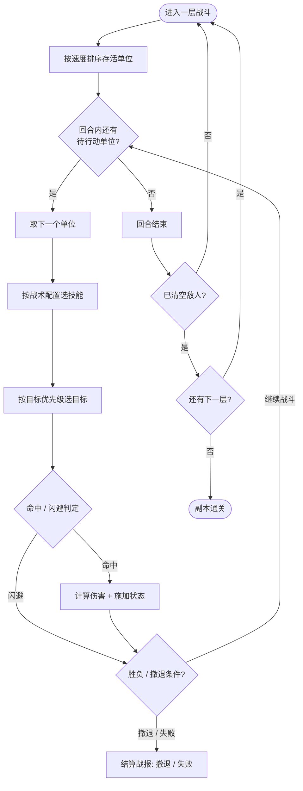
```mermaid
flowchart TD
    Start([进入一层战斗]) --> Sort[按速度排序存活单位]
    Sort --> Round{回合内还有<br/>待行动单位?}
    Round -->|是| Pick[取下一个单位]
    Pick --> Skill[按战术配置选技能]
    Skill --> Target[按目标优先级选目标]
    Target --> Judge{命中 / 闪避判定}
    Judge -->|命中| Resolve[计算伤害 + 施加状态]
    Judge -->|闪避| Check
    Resolve --> Check{胜负 / 撤退条件?}
    Check -->|继续战斗| Round
    Check -->|撤退 / 失败| Lose[结算战报: 撤退 / 失败]
    Round -->|否| EndRound[回合结束]
    EndRound --> Cleared{已清空敌人?}
    Cleared -->|否| Start
    Cleared -->|是| MoreL{还有下一层?}
    MoreL -->|是| Start
    MoreL -->|否| Win([副本通关])
```

### 2.2 副本生命周期

对应 §10.4。副本是有生命周期的机会，不是永久资源；失败/撤退不清除实例。

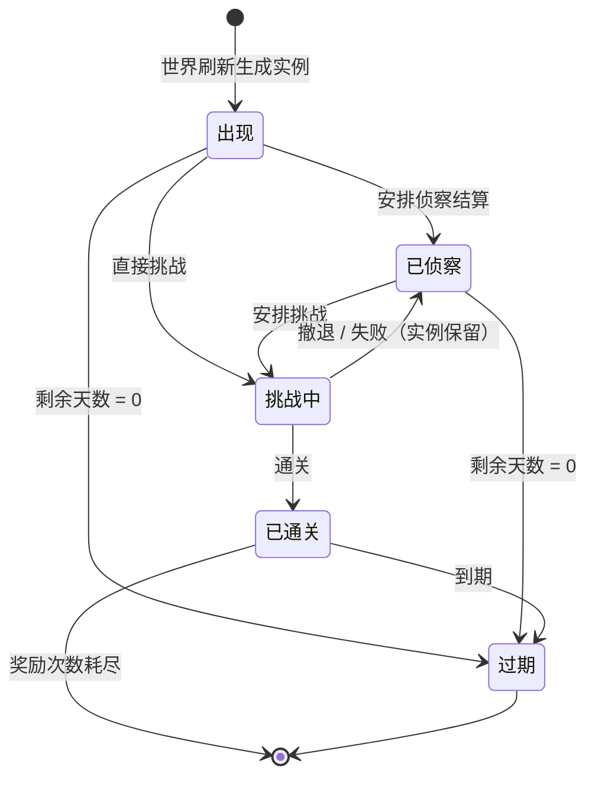
```mermaid
stateDiagram-v2
    [*] --> 出现 : 世界刷新生成实例
    出现 --> 已侦察 : 安排侦察结算
    出现 --> 挑战中 : 直接挑战
    已侦察 --> 挑战中 : 安排挑战
    挑战中 --> 已通关 : 通关
    挑战中 --> 已侦察 : 撤退 / 失败（实例保留）
    出现 --> 过期 : 剩余天数 = 0
    已侦察 --> 过期 : 剩余天数 = 0
    已通关 --> 过期 : 到期
    已通关 --> [*] : 奖励次数耗尽
    过期 --> [*]
```

### 2.3 副本多层推进与状态传递

对应 §5.5 / §10.5。副本由 3~5 层组成，角色状态在层间传递——这是撤退条件重要的根本原因。

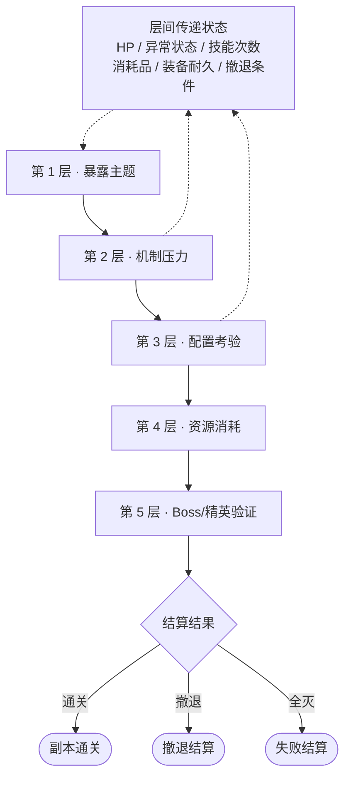
```mermaid
flowchart TD
    Carry["层间传递状态<br/>HP / 异常状态 / 技能次数<br/>消耗品 / 装备耐久 / 撤退条件"] -.-> L1
    L1["第 1 层 · 暴露主题"] --> L2["第 2 层 · 机制压力"]
    L2 --> L3["第 3 层 · 配置考验"]
    L3 --> L4["第 4 层 · 资源消耗"]
    L4 --> L5["第 5 层 · Boss/精英验证"]
    L2 -.-> Carry
    L3 -.-> Carry
    L5 --> Result{结算结果}
    Result -->|通关| Done([副本通关])
    Result -->|撤退| Ret([撤退结算])
    Result -->|全灭| Fail([失败结算])
```

### 2.4 情报分层解锁

对应 §11。情报分三层，随玩家投入逐步揭示，制造规划空间。

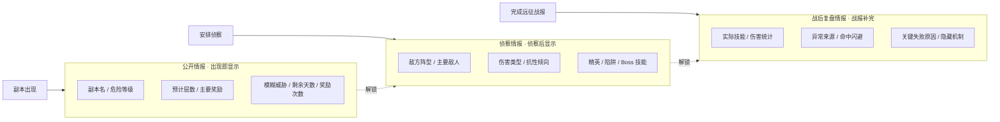
```mermaid
flowchart LR
    副本出现 --> L1
    安排侦察 --> L2
    完成远征战报 --> L3

    subgraph L1["公开情报 · 出现即显示"]
        P1[副本名 / 危险等级]
        P2[预计层数 / 主要奖励]
        P3[模糊威胁 / 剩余天数 / 奖励次数]
    end
    subgraph L2["侦察情报 · 侦察后显示"]
        S1[敌方阵型 / 主要敌人]
        S2[伤害类型 / 抗性倾向]
        S3[精英 / 陷阱 / Boss 技能]
    end
    subgraph L3["战后复盘情报 · 战报补完"]
        R1[实际技能 / 伤害统计]
        R2[异常来源 / 命中闪避]
        R3[关键失败原因 / 隐藏机制]
    end
    L1 -.解锁.-> L2
    L2 -.解锁.-> L3
```

### 2.5 职业定位象限

对应 §6.3。四个基础职业在「防御 × 功能」两轴上的定位，便于配队时互补。

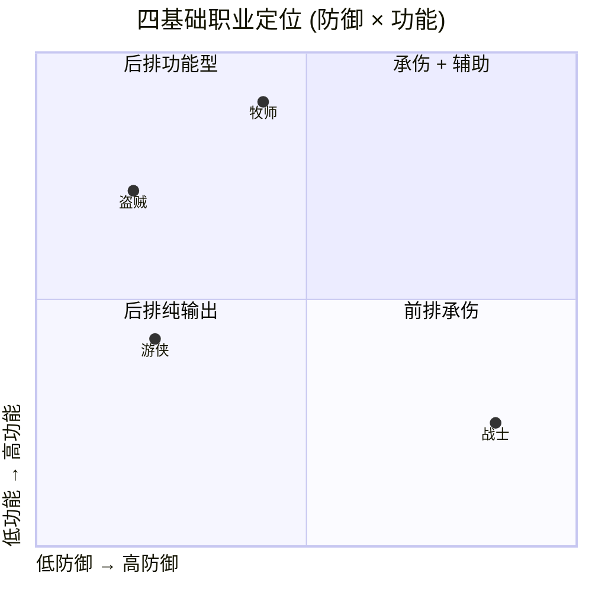
```mermaid
quadrantChart
    title 四基础职业定位 (防御 × 功能)
    x-axis 低防御 → 高防御
    y-axis 低功能 → 高功能
    quadrant-1 承伤 + 辅助
    quadrant-2 后排功能型
    quadrant-3 后排纯输出
    quadrant-4 前排承伤
    战士: [0.85, 0.25]
    游侠: [0.22, 0.42]
    牧师: [0.42, 0.90]
    盗贼: [0.18, 0.72]
```

### 2.6 副本系统结构

对应 §10。副本 = 模板（稳定设计）+ 实例（本次变体）+ 生命周期 + 多层结构 + 词缀。

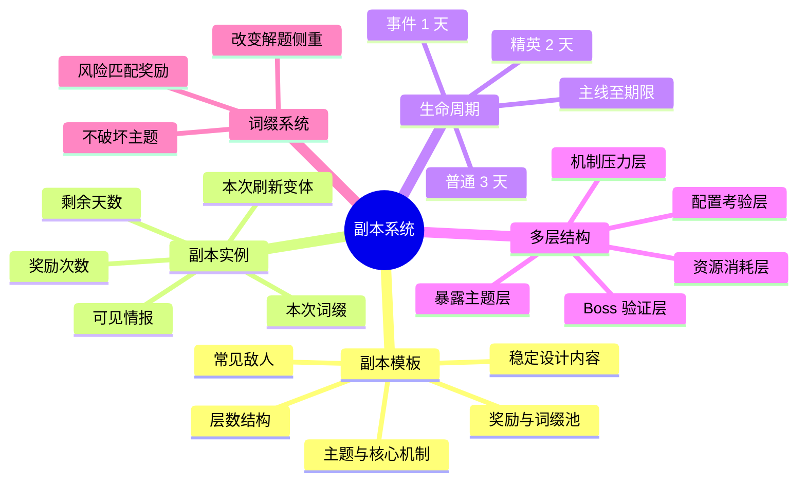
```mermaid
mindmap
  root((副本系统))
    副本模板
      稳定设计内容
      主题与核心机制
      层数结构
      常见敌人
      奖励与词缀池
    副本实例
      本次刷新变体
      剩余天数
      奖励次数
      本次词缀
      可见情报
    生命周期
      普通 3 天
      精英 2 天
      事件 1 天
      主线至期限
    多层结构
      暴露主题层
      机制压力层
      配置考验层
      资源消耗层
      Boss 验证层
    词缀系统
      改变解题侧重
      不破坏主题
      风险匹配奖励
```

---

## 第三部分 · 数据模型

### 3.1 核心数据模型 ER 图

对应 §33。逻辑模型，外键由关系表达，故不显式列出。CHARACTER 与 SKILL / EQUIPMENT / BATTLE_REPORT 为多对多。

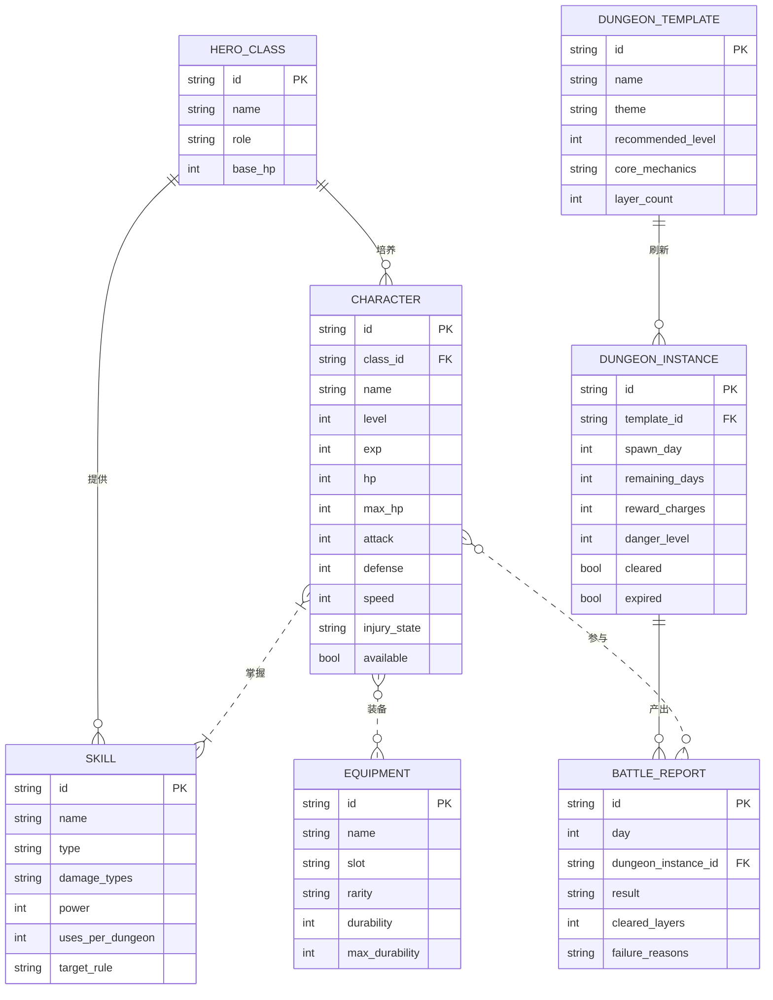
```mermaid
erDiagram
    HERO_CLASS ||--o{ CHARACTER : "培养"
    HERO_CLASS ||--o{ SKILL : "提供"
    CHARACTER }|..|{ SKILL : "掌握"
    CHARACTER }o..o{ EQUIPMENT : "装备"
    DUNGEON_TEMPLATE ||--o{ DUNGEON_INSTANCE : "刷新"
    DUNGEON_INSTANCE ||--o{ BATTLE_REPORT : "产出"
    CHARACTER }o..o{ BATTLE_REPORT : "参与"

    HERO_CLASS {
        string id PK
        string name
        string role
        int base_hp
    }
    CHARACTER {
        string id PK
        string class_id FK
        string name
        int level
        int exp
        int hp
        int max_hp
        int attack
        int defense
        int speed
        string injury_state
        bool available
    }
    SKILL {
        string id PK
        string name
        string type
        string damage_types
        int power
        int uses_per_dungeon
        string target_rule
    }
    EQUIPMENT {
        string id PK
        string name
        string slot
        string rarity
        int durability
        int max_durability
    }
    DUNGEON_TEMPLATE {
        string id PK
        string name
        string theme
        int recommended_level
        string core_mechanics
        int layer_count
    }
    DUNGEON_INSTANCE {
        string id PK
        string template_id FK
        int spawn_day
        int remaining_days
        int reward_charges
        int danger_level
        bool cleared
        bool expired
    }
    BATTLE_REPORT {
        string id PK
        int day
        string dungeon_instance_id FK
        string result
        int cleared_layers
        string failure_reasons
    }
```

### 3.2 战术配置模型

对应 §8。玩家战前配置：技能优先级 → 目标优先级 → 道具/撤退条件，自动战斗据此执行。

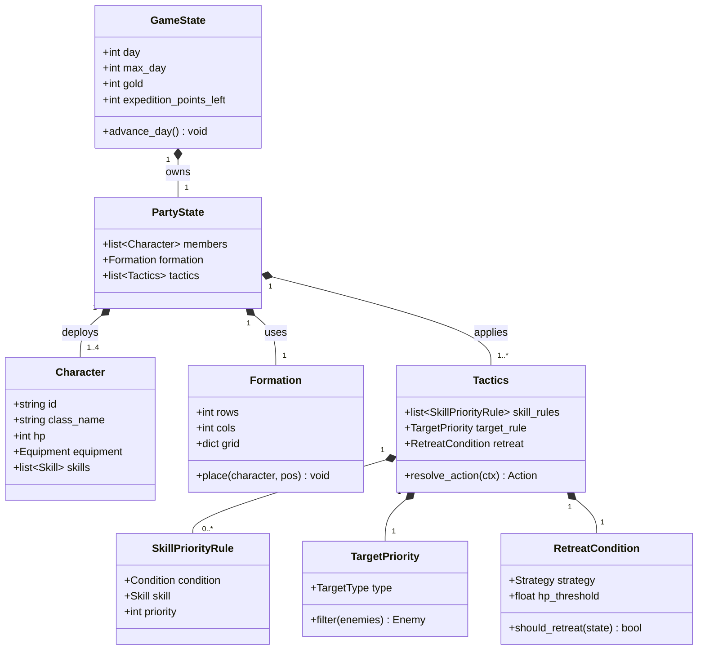
```mermaid
classDiagram
    class GameState {
        +int day
        +int max_day
        +int gold
        +int expedition_points_left
        +advance_day() void
    }
    class PartyState {
        +list~Character~ members
        +Formation formation
        +list~Tactics~ tactics
    }
    class Character {
        +string id
        +string class_name
        +int hp
        +Equipment equipment
        +list~Skill~ skills
    }
    class Formation {
        +int rows
        +int cols
        +dict grid
        +place(character, pos) void
    }
    class Tactics {
        +list~SkillPriorityRule~ skill_rules
        +TargetPriority target_rule
        +RetreatCondition retreat
        +resolve_action(ctx) Action
    }
    class SkillPriorityRule {
        +Condition condition
        +Skill skill
        +int priority
    }
    class TargetPriority {
        +TargetType type
        +filter(enemies) Enemy
    }
    class RetreatCondition {
        +Strategy strategy
        +float hp_threshold
        +should_retreat(state) bool
    }

    GameState "1" *-- "1" PartyState : owns
    PartyState "1" *-- "1..4" Character : deploys
    PartyState "1" *-- "1" Formation : uses
    PartyState "1" *-- "1..*" Tactics : applies
    Tactics "1" *-- "0..*" SkillPriorityRule
    Tactics "1" *-- "1" TargetPriority
    Tactics "1" *-- "1" RetreatCondition
```

---

## 第四部分 · 系统架构与数据流

### 4.1 系统整体架构

对应 §20 / §21。「规则核心独立，前端只负责展示和提交决策」。前端不持有权威状态，后端是规则唯一来源。

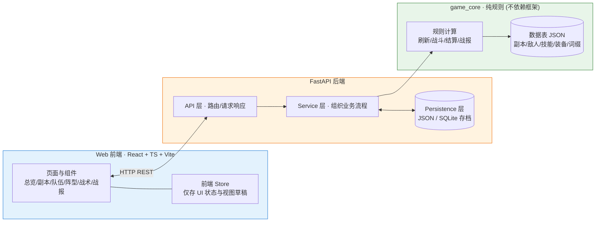
```mermaid
flowchart LR
    subgraph Web["Web 前端 · React + TS + Vite"]
        UI[页面与组件<br/>总览/副本/队伍/阵型/战术/战报]
        Store[前端 Store<br/>仅存 UI 状态与视图草稿]
    end
    subgraph Api["FastAPI 后端"]
        Routes[API 层 · 路由/请求响应]
        Svc[Service 层 · 组织业务流程]
        Persist[(Persistence 层<br/>JSON / SQLite 存档)]
    end
    subgraph Core["game_core · 纯规则 (不依赖框架)"]
        Rules[规则计算<br/>刷新/战斗/结算/战报]
        Data[(数据表 JSON<br/>副本/敌人/技能/装备/词缀)]
    end

    UI <-->|HTTP REST| Routes
    UI --- Store
    Routes --> Svc
    Svc --> Rules
    Svc <--> Persist
    Rules --> Data

    style Web fill:#e3f2fd,stroke:#1976d2
    style Api fill:#fff3e0,stroke:#ef6c00
    style Core fill:#e8f5e9,stroke:#2e7d32
```

### 4.2 后端四层架构

对应 §22.1。以「结束当天」为例展示一次完整请求如何穿过四层。

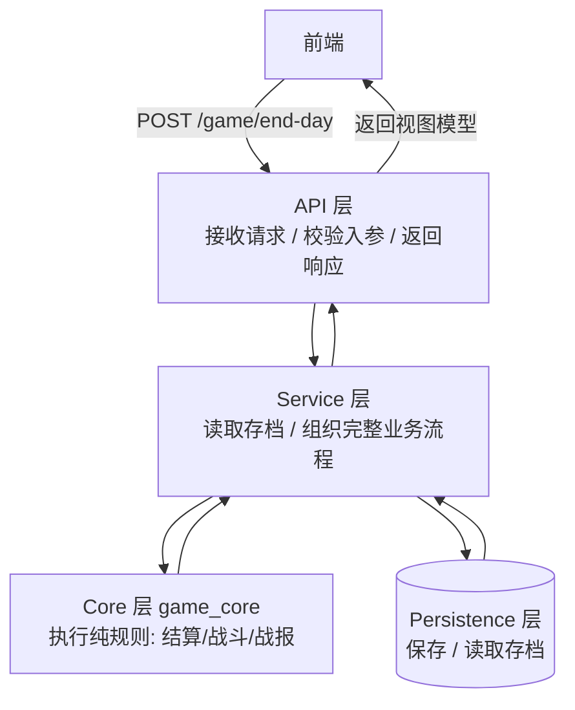
```mermaid
flowchart TD
    FE[前端] -->|POST /game/end-day| API[API 层<br/>接收请求 / 校验入参 / 返回响应]
    API --> Svc[Service 层<br/>读取存档 / 组织完整业务流程]
    Svc --> Core[Core 层 game_core<br/>执行纯规则: 结算/战斗/战报]
    Core --> Svc
    Svc --> Persist[(Persistence 层<br/>保存 / 读取存档)]
    Persist --> Svc
    Svc --> API
    API -->|返回视图模型| FE
```

### 4.3 结束当天完整时序

对应 §26.3 / §22.1。这是系统最关键的一条链路：提交计划 → 按序结算远征 → 逐层战斗 → 生成战报 → 日终推进。

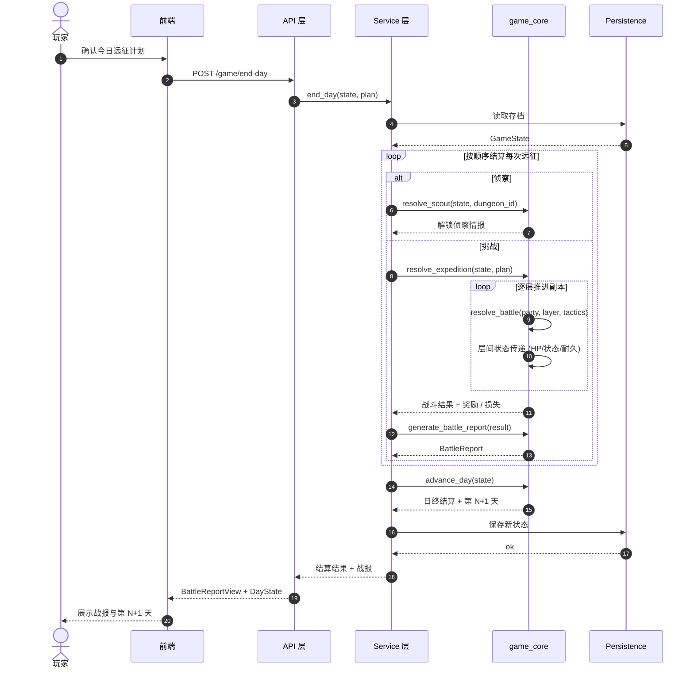
```mermaid
sequenceDiagram
    autonumber
    actor Player as 玩家
    participant FE as 前端
    participant API as API 层
    participant Svc as Service 层
    participant Core as game_core
    participant DB as Persistence

    Player->>FE: 确认今日远征计划
    FE->>API: POST /game/end-day
    API->>Svc: end_day(state, plan)
    Svc->>DB: 读取存档
    DB-->>Svc: GameState

    loop 按顺序结算每次远征
        alt 侦察
            Svc->>Core: resolve_scout(state, dungeon_id)
            Core-->>Svc: 解锁侦察情报
        else 挑战
            Svc->>Core: resolve_expedition(state, plan)
            loop 逐层推进副本
                Core->>Core: resolve_battle(party, layer, tactics)
                Core->>Core: 层间状态传递 (HP/状态/耐久)
            end
            Core-->>Svc: 战斗结果 + 奖励 / 损失
            Svc->>Core: generate_battle_report(result)
            Core-->>Svc: BattleReport
        end
    end

    Svc->>Core: advance_day(state)
    Core-->>Svc: 日终结算 + 第 N+1 天
    Svc->>DB: 保存新状态
    DB-->>Svc: ok
    Svc-->>API: 结算结果 + 战报
    API-->>FE: BattleReportView + DayState
    FE-->>Player: 展示战报与第 N+1 天
```

### 4.4 队伍配置数据流

对应 §26.4 / §25.3。体现「配置类操作允许前端草稿，但最终以后端确认为准」的原则。

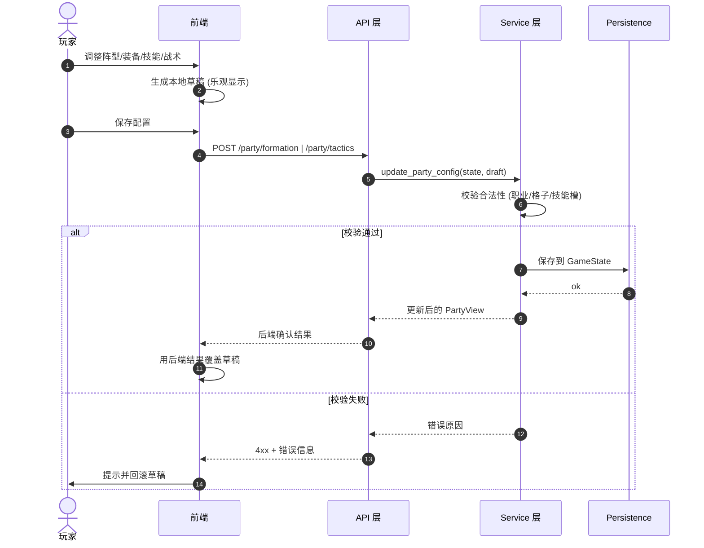
```mermaid
sequenceDiagram
    autonumber
    actor Player as 玩家
    participant FE as 前端
    participant API as API 层
    participant Svc as Service 层
    participant DB as Persistence

    Player->>FE: 调整阵型/装备/技能/战术
    FE->>FE: 生成本地草稿 (乐观显示)
    Player->>FE: 保存配置
    FE->>API: POST /party/formation | /party/tactics
    API->>Svc: update_party_config(state, draft)
    Svc->>Svc: 校验合法性 (职业/格子/技能槽)
    alt 校验通过
        Svc->>DB: 保存到 GameState
        DB-->>Svc: ok
        Svc-->>API: 更新后的 PartyView
        API-->>FE: 后端确认结果
        FE->>FE: 用后端结果覆盖草稿
    else 校验失败
        Svc-->>API: 错误原因
        API-->>FE: 4xx + 错误信息
        FE->>Player: 提示并回滚草稿
    end
```

### 4.5 前后端职责划分

对应 §20。game_core 不依赖 FastAPI 与数据库，保证可单元测试、可批量模拟。

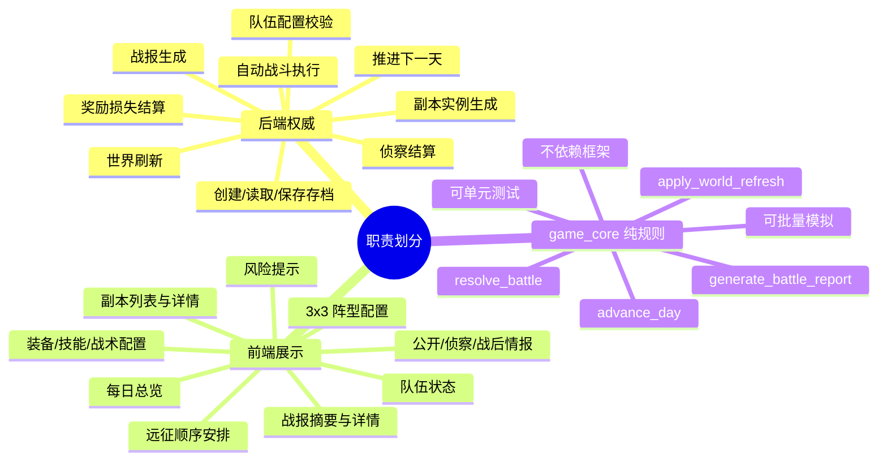
```mermaid
mindmap
  root((职责划分))
    后端权威
      创建/读取/保存存档
      世界刷新
      副本实例生成
      侦察结算
      队伍配置校验
      自动战斗执行
      奖励损失结算
      战报生成
      推进下一天
    前端展示
      每日总览
      副本列表与详情
      公开/侦察/战后情报
      队伍状态
      3x3 阵型配置
      装备/技能/战术配置
      远征顺序安排
      战报摘要与详情
      风险提示
    game_core 纯规则
      不依赖框架
      可单元测试
      可批量模拟
      apply_world_refresh
      resolve_battle
      generate_battle_report
      advance_day
```

---

## 第五部分 · 工程规划

### 5.1 项目结构

对应 §21。

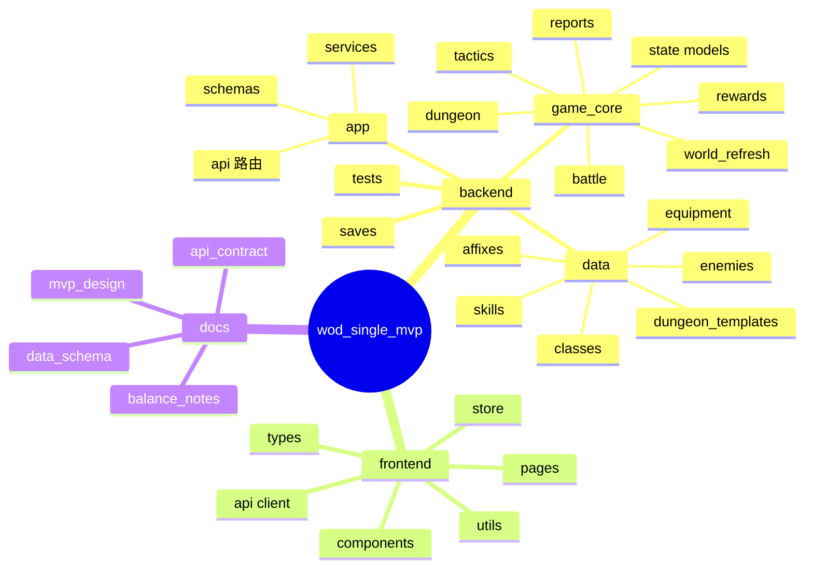
```mermaid
mindmap
  root((wod_single_mvp))
    backend
      app
        api 路由
        services
        schemas
      game_core
        state models
        world_refresh
        dungeon
        battle
        tactics
        rewards
        reports
      data
        dungeon_templates
        enemies
        classes
        skills
        equipment
        affixes
      saves
      tests
    frontend
      api client
      store
      pages
      components
      types
      utils
    docs
      mvp_design
      data_schema
      api_contract
      balance_notes
```

### 5.2 MVP 开发路线图

对应 §27 / §28 / §35 的五阶段优先级。最后到达最终 Boss 副本验收（标红）。

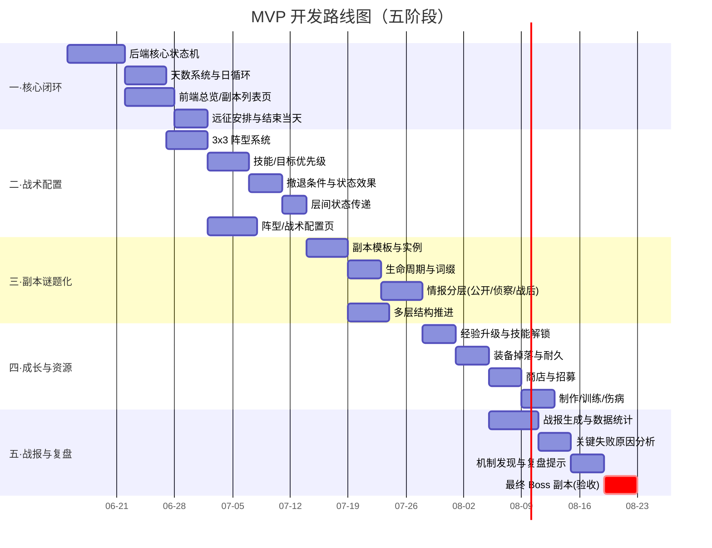
```mermaid
gantt
    title MVP 开发路线图（五阶段）
    dateFormat YYYY-MM-DD
    axisFormat %m-%d

    section 一·核心闭环
    后端核心状态机             :be1, 2026-06-15, 7d
    天数系统与日循环           :be2, after be1, 5d
    前端总览/副本列表页        :fe1, after be1, 6d
    远征安排与结束当天         :fe2, after fe1, 4d

    section 二·战术配置
    3x3 阵型系统              :t1, after be2, 5d
    技能/目标优先级            :t2, after t1, 5d
    撤退条件与状态效果         :t3, after t2, 4d
    层间状态传递               :t4, after t3, 3d
    阵型/战术配置页            :t5, after fe2, 6d

    section 三·副本谜题化
    副本模板与实例             :d1, after t4, 5d
    生命周期与词缀             :d2, after d1, 4d
    情报分层(公开/侦察/战后)   :d3, after d2, 5d
    多层结构推进               :d4, after d1, 5d

    section 四·成长与资源
    经验升级与技能解锁         :g1, after d3, 4d
    装备掉落与耐久             :g2, after g1, 4d
    商店与招募                 :g3, after g2, 4d
    制作/训练/伤病             :g4, after g3, 4d

    section 五·战报与复盘
    战报生成与数据统计         :r1, after g2, 6d
    关键失败原因分析           :r2, after r1, 4d
    机制发现与复盘提示         :r3, after r2, 4d
    最终 Boss 副本(验收)       :crit, boss, after r3, 4d
```

### 5.3 API 设计

对应 §23。接口围绕**玩家动作**设计，而非数据库 CRUD。

```mermaid
mindmap
  root((API 围绕玩家动作))
    基础游戏
      POST /game/new
      GET /game/state
      POST /game/save
      POST /game/load
      POST /game/end-day
    副本
      GET /dungeons
      GET /dungeons/id
      POST /dungeons/id/scout
      POST /dungeons/id/challenge
    队伍
      GET /party
      POST /party/formation
      POST /party/equipment
      POST /party/skills
      POST /party/tactics
      POST /party/retreat-condition
    远征计划
      GET /expedition-plan
      POST /expedition-plan
      POST /expedition-plan/reorder
    战报
      GET /reports
      GET /reports/id
      GET /reports/id/summary
      GET /reports/id/turns
    调试(不暴露正式模式)
      add-gold add-item
      spawn-dungeon
      advance-day
```

### 5.4 副本词缀系统

对应 §12。词缀改变解题侧重点，但不破坏副本主题身份。

```mermaid
mindmap
  root((副本词缀))
    增加难度/奖励
      精英盘踞
      宝藏暴露
      Boss 变异
      时间紧迫
    改变机制压力
      毒雾弥漫
      陷阱密布
      重甲敌群
      怪物暴动
    影响情报/资源
      侦察困难
      资源丰富
    设计原则
      改变解题侧重
      不破坏主题身份
      可预判
      风险匹配奖励
      不产生无解组合
```

---

## 附：图类型与对应文档章节速查

| 图 | 类型 | 对应 mvp文档.md 章节 |
| --- | --- | --- |
| 1.1 核心体验循环 | flowchart | §2.2 |
| 1.2 每日回合流程 | flowchart | §5 |
| 1.3 远征决策 | flowchart | §2.1 / §5.3 / §14.2 |
| 1.4 30 天节奏 | timeline | §4.1 |
| 1.5 游戏阶段状态机 | stateDiagram | §4 / §28 |
| 2.1 战斗回合流程 | flowchart | §9 |
| 2.2 副本生命周期 | stateDiagram | §10.4 |
| 2.3 多层推进与状态传递 | flowchart | §5.5 / §10.5 |
| 2.4 情报分层解锁 | flowchart | §11 |
| 2.5 职业定位象限 | quadrantChart | §6.3 |
| 2.6 副本系统结构 | mindmap | §10 |
| 3.1 核心数据模型 | erDiagram | §33 |
| 3.2 战术配置模型 | classDiagram | §8 |
| 4.1 系统整体架构 | flowchart | §20 / §21 |
| 4.2 后端四层架构 | flowchart | §22.1 |
| 4.3 结束当天时序 | sequenceDiagram | §26.3 / §22.1 |
| 4.4 队伍配置数据流 | sequenceDiagram | §26.4 / §25.3 |
| 4.5 前后端职责划分 | mindmap | §20 |
| 5.1 项目结构 | mindmap | §21 |
| 5.2 开发路线图 | gantt | §27 / §28 / §35 |
| 5.3 API 设计 | mindmap | §23 |
| 5.4 副本词缀系统 | mindmap | §12 |
